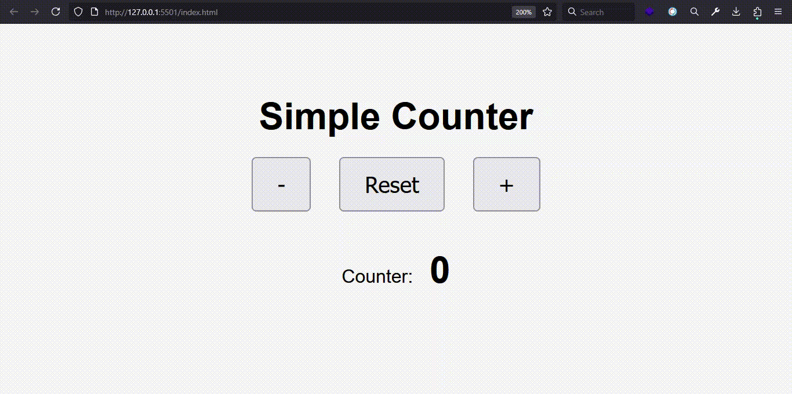
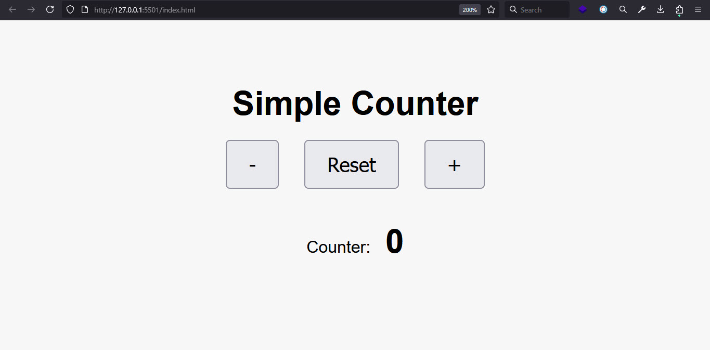

# Simple JavaScript Counter

This is a beginner-friendly counter application built with **HTML**, **CSS**, and **JavaScript**.  
Users can increment, decrement, or reset the value, and the counter color changes based on the value.

## 🚀 Features

- Increment (+) and Decrement (-) buttons
- Reset to zero
- Dynamic color based on value
- Fully responsive UI

## 🚀 Live Demo


## 🧠 Concepts Used

- `addEventListener` for handling events
- `textContent` for DOM manipulation
- `querySelector` and `querySelectorAll`
- Conditional styling in JavaScript

## 📸 Screenshot




## 📦 How to Use

Clone the repo and open `index.html` in your browser:

```bash
git clone https://github.com/sajjad7181/simple-counter-in-javascript.git
cd counter-app
open index.html
```

### 👨‍💻 Author
Made with ❤️ by [Sajjad Hosseinzadeh](https://github.com/sajjad7181)
